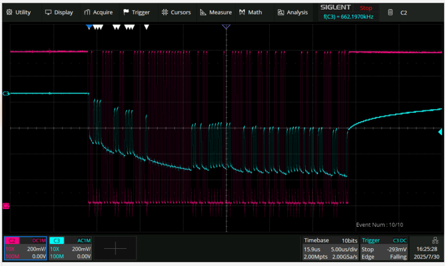

# jadard-kmod MIPI DSI driver

Linux kernel module for latest Jadard display controller `jd9365tn`

Developed based on reverse engineering MIPI interface between
HDMI-MIPI bridge board provided by manufacturer.

Driver is in work in progress state however the main functionality is there.

Lacking power managment features.

Tested on `stm32mp157f-dk2` devboard with custom MIPI adapter.

### Display running DOOM

### Display running Weston Destkop Environment

## Reverse Enginnering MIPI LP packet example

